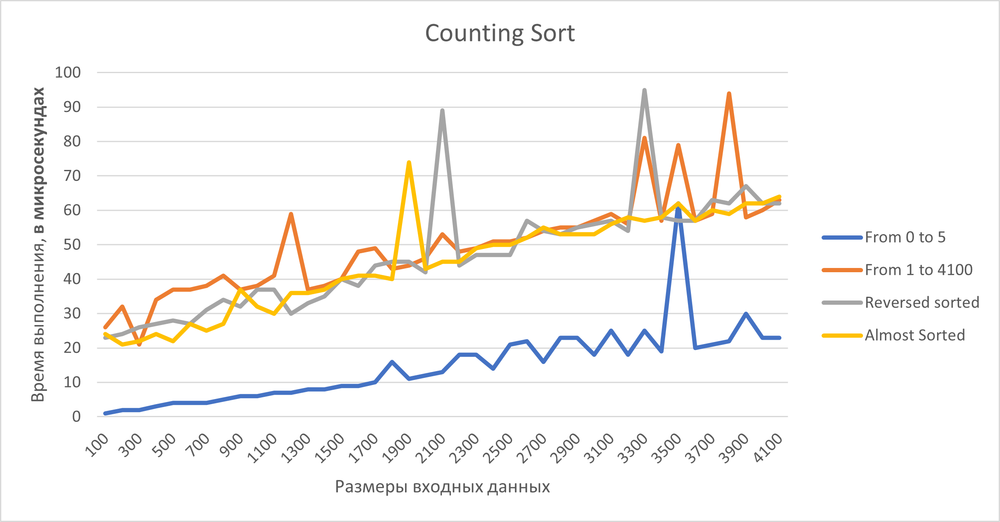
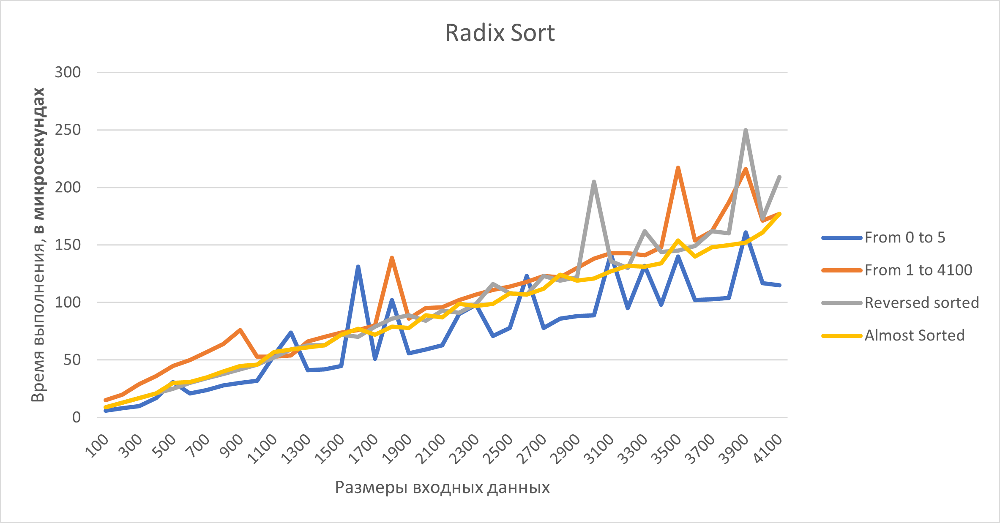
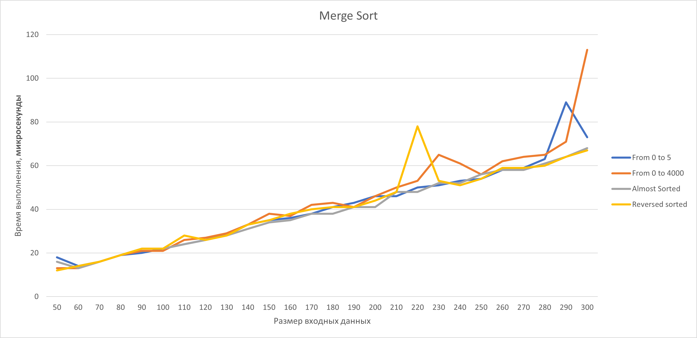
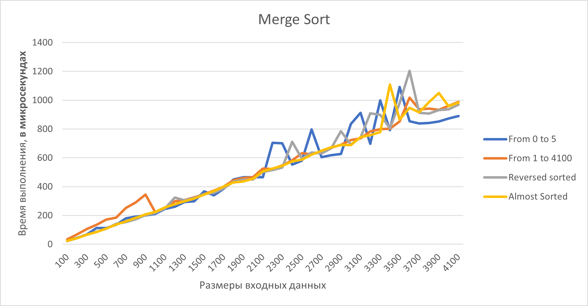

# КДЗ. Экспериментальное сравнение сортировок

### Туракулов Исломбек Улугбекович

### Оценка: 10 из 10

# Sorting Algorithms

Использованы следующие сортировки:

- [Selection Sort](./Sort-Algorithms/SelectionSort.cpp)
- [Bubble Sort](./Sort-Algorithms/BubbleSort.cpp)
- [Bubble Sort Iverson 1](./Sort-Algorithms/BubbleSort.cpp)
- [Bubble Sort Iverson 1 + 2](./Sort-Algorithms/BubbleSort.cpp)
- [Insertion Sort](./Sort-Algorithms/InsertionSort.cpp)
- [Binary Insertion sort](./Sort-Algorithms/InsertionSort.cpp)
- [Counting Sort](./Sort-Algorithms/CountingSort.cpp)
- [Radix Sort](./Sort-Algorithms/CountingSort.cpp)
- [Merge Sort](./Sort-Algorithms/MergeSort.cpp)
- [Quick sort Hoare partition](./Sort-Algorithms/QuickSort.cpp)
- [Quick sort Lomuto partition](./Sort-Algorithms/QuickSort.cpp)
- [Heap sort](./Sort-Algorithms/HeapSort.cpp)

## Table of contents

<!--ts-->

* [Алгоритмы сортировки](#sorting-algorithms)
* [Содержание](#table-of-contents)
* [Введение](#getting-started)
    * [Запуск программы](#running-the-program)
    * [Сохранение данных](#saving-data)
    * [Информация в командной строке](#input-information)
* [Анализ времени выполнения](#time-complexity-analysis)
    * [O(k+n)](#okn)
    * [O(nlg(n))](#onlgn)
    * [O(n^2)](#on2)
    * [O(n)](#on2)
* [Условие КДЗ](./Условие/КДЗ.pdf)

<!--te-->

## Getting Started

Инструкции описанные ниже слегка помогут вам понять как устроен мой проект. Однако у меня расположены комментарии в
коде, всё-таки нужно разнообразие :)
И да, подсказки в проекте написаны на английском, чтобы вдруг не слетела кодировка проверяющего ну или у меня.

### Running the program

1. Откройте проект

    ```
    ⣿⣿⣿⣿⣿⣿⣿⣿⣿⣿⣿⣿⣿⣿⣿⣿⣿⣿⣿⣿⣿⣿⣿⣿⣿⣿⣿⣿⣿⣿
    ⣿⠟⠫⢻⣿⣿⣿⣿⢟⣩⡍⣙⠛⢛⣿⣿⣿⠛⠛⠛⠛⠻⣿⣿⣿⣿⣿⡿⢿⣿
    ⣿⠤⠄⠄⠙⢿⣿⣿⣿⡿⠿⠛⠛⢛⣧⣿⠇⠄⠂⠄⠄⠄⠘⣿⣿⣿⣿⠁⠄⢻
    ⣿⣿⣿⣿⣶⣄⣾⣿⢟⣼⠒⢲⡔⣺⣿⣧⠄⠄⣠⠤⢤⡀⠄⠟⠉⣠⣤⣤⣤⣾
    ⣿⣿⣿⣿⣿⣿⣿⣿⣿⣟⣀⣬⣵⣿⣿⣿⣶⡤⠙⠄⠘⠃⠄⣴⣾⣿⣿⣿⣿⣿
    ⣿⣿⣿⣿⣿⣿⣿⣿⣿⡿⢻⠿⢿⣿⣿⠿⠋⠁⠄⠂⠉⠒⢘⣿⣿⣿⣿⣿⣿⣿
    ⣿⣿⣿⣿⣿⣿⣿⣿⡿⣡⣷⣶⣤⣤⣀⡀⠄⠄⠄⠄⠄⠄⠄⣾⣿⣿⣿⣿⣿⣿   <- Это Шрек
    ⣿⣿⣿⣿⣿⣿⣿⡿⣸⣿⣿⣿⣿⣿⣿⣿⣷⣦⣰⠄⠄⠄⠄⢾⠿⢿⣿⣿⣿⣿   <- красивый?
    ⣿⡿⠋⣡⣾⣿⣿⣿⡟⠉⠉⠈⠉⠉⠉⠉⠉⠄⠄⠄⠑⠄⠄⠐⡇⠄⠈⠙⠛⠋
    ⠋⠄⣾⣿⣿⣿⣿⡿⠄⠄⠄⠄⠄⠄⠄⠄⠄⠄⠄⠄⠄⠄⠄⢠⡇⠄⠄⠄⠄⠄
    ⠄⢸⣿⣿⣿⣿⣿⣯⠄⢠⡀⠄⠄⠄⠄⠄⠄⠄⠄⣀⠄⠄⠄⠄⠁⠄⠄⠄⠄⠄
    ⠁⢸⣿⣿⣿⣿⣿⣯⣧⣬⣿⣤⣐⣂⣄⣀⣠⡴⠖⠈⠄⠄⠄⠄⠄⠄⠄⠄⠄⠄
    ⠈⠈⣿⣟⣿⣿⣿⣿⣿⣿⣿⣿⣽⣉⡉⠉⠈⠁⠄⠁⠄⠄⠄⠄⡂⠄⠄⠄⠄⠄
    ⠄⠄⠙⣿⣿⠿⣿⣿⣿⣿⣷⡤⠈⠉⠉⠁⠄⠄⠄⠄⠄⠄⠄⠠⠔⠄⠄⠄⠄⠄
    ⠄⠄⠄⡈⢿⣷⣿⣿⢿⣿⣿⣷⡦⢤⡀⠄⠄⠄⠄⠄⠄⢐⣠⡿⠁⠄⠄⠄⠄⠄
    ```

2. Создать сборку проекта.

3. Запустите программу.

    ```
    <input> -> typed [1] {Selection Sort}
    ```

   Это позволит отсортировать значения из разных режимов. Если все пойдет правильно, вы должны увидеть этот результат.

    ```
    Please wait...
    Progress: 20%
    Progress: 40%
    Progress: 60%
    Progress: 80%
    Progress: 100%
    Done! Files are located to the cmake-build-debug directory
    ```

### Saving data

1. После запуска сортировок(-ки) все данные записываются в  (`cmake-build-debug/...`) с названиями:

    ```
    First.csv
    input - 1.txt
    input - 2.txt
    Second.csv
    ```

   Например, при выборе сортировки пункта `[1]` то есть `Selection Sort` данные записываются в табличном виде в
   файлах `First` и `Second` с расширением `.csv`

### Input information

После запуска `main.cpp` пользователю отображаются доступные виды сортировок, которые описаны ниже. Можно использовать,
как и одну или все сортировку сразу.

```
===== Available sort algorithms =====
[1] - Selection sort
[2] - Bubble sort
[3] - Bubble sort v 1
[4] - Bubble sort v 1 and 2
[5] - Insertion sort
[6] - Binary insertion sort
[7] - Counting sort
[8] - Radix sort
[9] - Merge sort
[10] - QuickSort (Hoare partition)
[11] - QuickSort (Lomuto partition)
[12] - HeapSort
[13] - Choose all sort algorithms
By default program choose - [13]
=================================
Type here: <input>
```

All the possible values for `<input>` is integer.

## Time complexity analysis

Измерение выполнения программы было произведено с следующими характеристиками ноутбука:

```
Процессор:	Intel(R) Core(TM) i5-10300H CPU @ 2.50GHz   2.50 GHz
ОЗУ:	        16,00 ГБ
Тип системы:	64-разрядная операционная система, процессор x64
```

```
Выпуск:	        Windows 10 Pro
Версия:	        21H1
Сборка ОС:	19043.1526
Взаимодействие:	Windows Feature Experience Pack 120.2212.4170.0
```

Для проверки использован Ubuntu

```
$ g++ --version
g++ (Ubuntu 9.3.0-17ubuntu1~20.04) 9.3.0
Copyright (C) 2019 Free Software Foundation, Inc.
This is free software; see the source for copying conditions. 
There is NO warranty; 
not even for MERCHANTABILITY or FITNESS FOR A PARTICULAR PURPOSE.

$ lsb_release -a
No LSB modules are available.
Distributor ID:	Ubuntu
Description:	Ubuntu 20.04.3 LTS
Release:	20.04
Codename:	focal

$ uname -a
Linux islam-VirtualBox 5.11.0-40-generic #44~20.04.2-Ubuntu SMP Tue Oct 26 18:07:44 UTC 2021 x86_64 x86_64 x86_64 GNU/Linux
```

### O(k+n)

Radix и Counting Sort возглавляют список, когда дело доходит до низкого времени выполнения, но за это приходится платить
памятью.

Сортировке подсчётом (Counting Sort) заранее требуется максимальный элемент
(вычисление которого не учитывалось с учетом временной сложности,
[тык сюда](./Sort-Algorithms/CountingSort.cpp#L16)) и его простанственная сложность равна O(k+n). Ради интереса решил
попробовать сгенерить огромное количество элементов, но увы у меня выходил Segmentation Fault.

Radix sort тоже имеет пространственную сложность вида O(k+n) ([тык сюда](Sort-Algorithms/CountingSort.cpp#L34)).






### O(nlg(n))

Следующий список возглавляет Merge Sort с временем исполнения O(nlg(n)). В худших и лучших случаях, он ведёт себя
нормально, ниже приведены все варианты событий.




### O(n^2)

В конце у нас есть Bubble, Insertion, Selection и т.д. Они по сути самые лёгкие для написания, но очень затратные..

Для маленьких входных данных, время O(nlg(n)) и O(n^2) не буду значить ничего стоящего.Размерности входных данных кол-ва
300 элементов, разница в худшем случае будет в промежутке 200 микросекунд.


Однако по мере увеличения размера входных данных увеличивается и время выполнения. Для входного массива из максимальных
элементов время выполнения составляет значительно больше времени...


Означает ли это, что мы ВСЕГДА должны использовать алгоритм сортировки с временной сложностью O (n log(n)) вместо O (n ^
2)? Что ж, в большинстве случаев ответ - да, но не всегда. Предыдущие измерения были сделаны для случайного ввода, но в
лучшем случае роли меняются местами.


Подводя итог, можно сказать, что алгоритм сортировки, который следует использовать, зависит от множества различных
аспектов, таких как размер ввода, случайность ввода, доступная оперативная память и количество доступных ядер CPU / GPU.
Например, radix очень популярен в параллельных структурах, но не так сильно в системах с одним процессором. Если вы
сортируете полностью случайные данные, Merge sort должна быть использована, но если вы вставляете новую запись в
отсортированную базу данных, binary insertion sort может быть подходящим вариантом
А во встраиваемых системах никогда не надо забывать о сложностях пространства.
